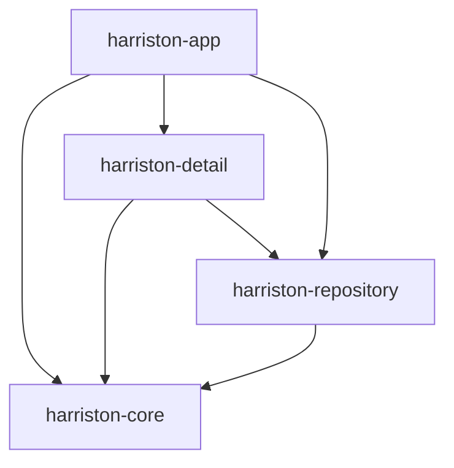
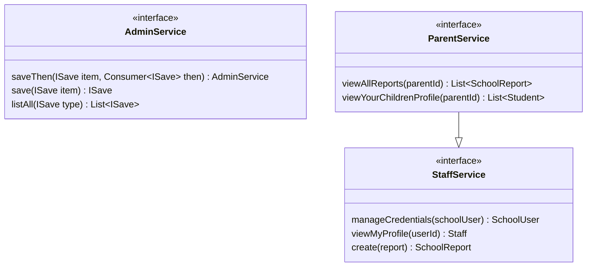

# Gondai School Management System

## Overview
School Management System is a Spring multi-module project aimed at providing a comprehensive solution for managing various aspects of a school, including student information, staff details, school reports and more.

## Module Relationships

## Modules

### 1. `harriston-app`
This module contains the main application logic and is responsible for handling HTTP requests, managing controllers, and serving as the entry point for the application.

### 2. `harriston-core`
The harriston-core module serves as the core of the application, containing shared functionality, utility classes, and domain entities that are used across different parts of the system. It defines the fundamental building blocks of the application architecture.
They are 3 major contracts or interfaces in this module which make up the whole API:

### 3. `harriston-detail`
The harriston-detail module focuses on providing implementation on the contracts/interfaces defined in harriston-core. These implementations will be injected into our `controllers` at runtime.

### 4. `harriston-repository`
The harriston-repository module acts as a data access layer, providing interfaces and implementations for interacting with various data sources such as databases, external APIs, or file systems. It encapsulates the logic for storing and retrieving data.

## `Technologies Used`
- Java 21  (enabled virtual threads)
- Spring Boot Web
- Spring Data JPA
- Lombok
- Postgres DB + Spring Docker compose 
- Maven
- Swagger

## `Setup Instructions`
Please make sure to have installed `Docker` on your machine
1. Clone the repository: `git clone https://github.com/gondaimgano/harriston-school.git`
2. Navigate to the project directory: `cd harriston-school`
3. Build the project: `mvn clean install`
4. Run the application: `java -jar harriston-app/target/harriston-app-1.0.1-DOGFOOD.jar`
5. To access the apis `http://localhost:9000/v1/swagger-ui`

## `Usage`
- Access the application through the provided endpoints.
- Use the provided APIs to perform CRUD operations on student, staff, parent, and other entities.
- Customize and extend the application as needed for specific school management requirements.

## `Contributing`
Contributions are welcome! If you have suggestions, enhancements, or bug fixes, please submit a pull request or open an issue on GitHub.

## `License`
This project is licensed under the [MIT License](LICENSE).
